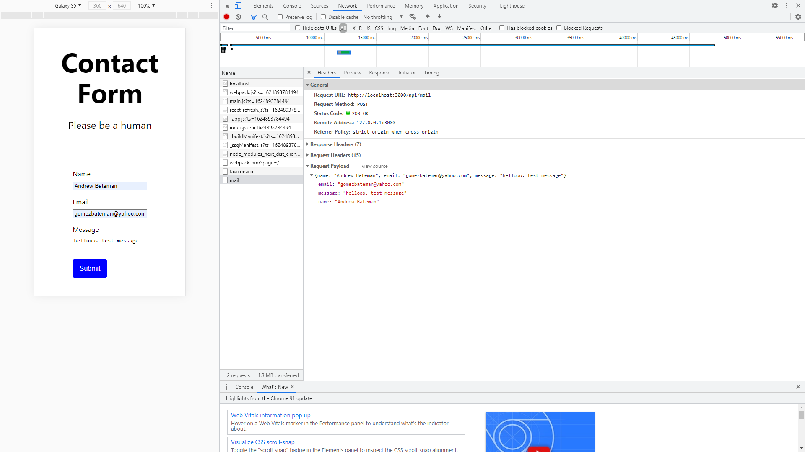

# :zap: Next Serverless Sendgrid

* A simple Next.js React app to send emails from a web page contact form using [Sendgrid](https://sendgrid.com/) and Node.js
* **Note:** to open web links in a new window use: _ctrl+click on link_


## :page_facing_up: Table of contents

* [:zap: Next API Data](#zap-next-api-data)
  * [:page_facing_up: Table of contents](#page_facing_up-table-of-contents)
  * [:books: General Info](#books-general-info)
  * [:camera: Screenshots](#camera-screenshots)
  * [:signal_strength: Technologies](#signal_strength-technologies)
  * [:floppy_disk: Setup](#floppy_disk-setup)
  * [:computer: Code Examples](#computer-code-examples)
  * [:clipboard: Status & To-Do List](#clipboard-status--to-do-list)
  * [:clap: Inspiration](#clap-inspiration)
  * [:file_folder: License](#file_folder-license)
  * [:envelope: Contact](#envelope-contact)

## :books: General Info

* Uses a html/css contact form to create HTML5 FormData Javascript object to an object of JSON strings that is sent to a designated email address using Sendgrid.
* Next.js is for server-rendered react apps. It has automatic code splitting, simple page-based routing, built-in CSS support and hot reloading. Every component file in the pages folder is treated as a page

## :camera: Screenshots

.

## :signal_strength: Technologies

* [Node.js v14](https://nodejs.org/) javascript runtime using the [Chrome V8 engine](https://v8.dev/).
* [React v17](https://reactjs.org/) Javascript library.
* [Next v11](https://nextjs.org/) minimalist framework for rendering react apps on the server.
* [Sendgrid Web API v3 Node.js Mail Service v7](https://github.com/sendgrid/sendgrid-nodejs/tree/main/packages/mail)

## :floppy_disk: Setup

* Register with [Sendgrid](https://sendgrid.com/)
* If you have a domain, configure DNS CNAME records as per tutorial - see [Inspiration below](## :clap: Inspiration)
* `npm run dev` runs the app in the development mode. Open [http://localhost:3000](http://localhost:3000) to view it in the browser.
* `npm run build` builds the app for production to the `build` folder. It correctly bundles React in production mode and optimizes the build for the best performance. The build is minified and the filenames include the hashes.

## :computer: Code Examples

* `index.js` function to convert HTML5 form data to a JSON object

```javascript
  async function handleOnSubmit(e) {
    e.preventDefault();
    const formData = {};
    Array.from(e.currentTarget.elements).forEach(field => {
      if (!field.name) return;
      formData[field.name] = field.value;
    });
    fetch('/api/mail', {
      method: 'post',
      body: JSON.stringify(formData)
    })
    console.log('formData: ', formData);
  }
```

## :clipboard: Status & To-Do List

* Status: Working
* To-Do: Add acknowledgement after email sent

## :clap: Inspiration

* [Colby Fayock: Send Emails with SendGrid & Next.js Serverless Functions - Contact Form Tutorial](https://www.youtube.com/watch?v=QrVYLLpoyMw&t=51s)
* [Go Make Things: Serializing form data with the vanilla JS FormData() object](https://gomakethings.com/serializing-form-data-with-the-vanilla-js-formdata-object/)

## :file_folder: License

* N/A

## :envelope: Contact

* Repo created by [ABateman](https://github.com/AndrewJBateman), email: gomezbateman@yahoo.com
